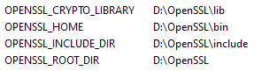
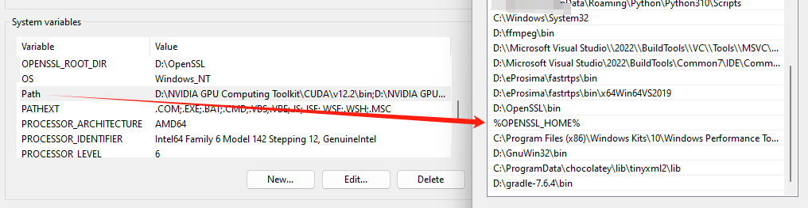

# workspace_DDSHelloWorld

## 1. File Tree
    ```
    .
    └── workspace_DDSHelloWorld
        ├── build
        ├── CMakeLists.txt
        └── src
            ├── HelloWorld.cxx
            ├── HelloWorld.h
            ├── HelloWorld.idl
            ├── HelloWorldCdrAux.hpp
            ├── HelloWorldCdrAux.ipp
            ├── HelloWorldPublisher.cpp
            ├── HelloWorldPubSubTypes.cxx
            ├── HelloWorldPubSubTypes.h
            └── HelloWorldSubscriber.cpp
    ```

## 2. Environment and Start
1. OS: Windows 10/11

2. IDE: Visual Studio 2022 (with `Desktop development with C++`)

3. [eProsima Fast DDS installing](https://eprosima.com/index.php/downloads-all). Tick all boxes of environment variable setup. Recommend changing the folder name to `fastrtps`, which has no spacing.

4. [CMake installing](https://cmake.org/), [Chocolatey installing](https://chocolatey.org/)

5. Dependencies: [Asio](https://github.com/ros2/choco-packages/releases/download/2020-02-24/asio.1.12.1.nupkg), [TinyXML2](https://github.com/ros2/choco-packages/releases/download/2020-02-24/tinyxml2.6.0.0.nupkg). After downloading these packages, open an administrative shell with PowerShell and execute the following command:

   ```
   choco install -y -s <PATH_TO_DOWNLOADS> asio tinyxml2
   ```

   where `<PATH_TO_DOWNLOADS>` is the folder into which the packages have been downloaded.

   

   OpenSSL is a robust toolkit for the TLS and SSL protocols and a general-purpose cryptography library. Install it by running the following command inside an administrative shell with PowerShell:

   ```
   choco install -y openssl
   ```

   Make sure to configure your system variables:

   

   

6. Run following commands in `build/`:
    ```
    cmake ..
    cmake --build .
    cd build/Debug/
    DDSHelloWorldPublisher.exe
    DDSHelloWorldSubscriber.exe
    ```

7. Succeed!